# 💳 ELK 기반 금융 데이터 분석 및 잠재고객 세분화

## 📌 프로젝트 개요

본 프로젝트는 금융 실무 데이터를 기반으로 우리카드 고객의 라이프스테이지 변화에 따른 소비 패턴을 분석한다. ELK 스택을 활용하여 소비 성장세가 뚜렷한 **잠재 고객**을 식별하고 데이터 기반의 정교한 타겟 마케팅 시나리오를 제안한다.

---

 

## 🎯 프로젝트 목표 (Project Goals)

### 1. 비즈니스 관점

- **실무 데이터 인사이트 도출**: 2023 3분기 ~ 2025년 2분기 까지의 시계열 데이터를 분석하여 유의미한 소비 트렌드 및 타겟 고객군 발굴
- **직관적인 의사결정 지원**: 복잡한 금융 데이터를 Kibana 대시보드로 시각화하여 마케팅 전략 수립의 가독성 확보

### 2. 기술적 관점

- **인프라 구축**: **LINUX OS** 환경 내 ELK 스택 설치 및 포트포워딩 설정
- **데이터 파이프라인**: DuckDB를 활용하여 대량의 데이터를 전처리하고 Elasticsearch에 최적화하여 인덱싱
- **성능 최적화**: 대시보드 조회 성능 향상을 위한 인덱스 매핑 최적화

---

 

## ✅ 잠재 고객 추정 전략

### 잠재 고객이란 ❓

향후 카드 사용량이 추가로 증가할 가능성이 있는 고객

- 현재 소비 규모가 큰 고객 ❌ -> 증가 여지보단 유지 대상
- 일시적 고액 결제 고객 (이벤트성 소비자) ❌ -> 구조적 소비 증가로 이루어질 확률 낮음
- 소비 규모가 변하지 않는 고객 ❌ -> 소비 성향 고정. 확장 가능성 낮음

### 어떤 집단이 잠재 고객일 확률이 높을까❓

어떤 집단이 향후 지출이 많아질 가능성이 있을까?

### 1. 라이프 스테이지별 집단

#### 1-1. 사회초년생

- 소득 발생 시작 ❗
- 현금 위주 소비 -> 신용카드 중심 소비로 전환
- 생활비, 자기계발, 여가 소비가 점진적으로 확대됨

#### 1-2. 영유아 자녀를 둔 부모

- 출산 이후 지출 항목 증가 ex) 분유, 기저귀, 병원비, 육아용품
- 소비가 단기성이 아닌 지속적인 구조

#### 1-3. 의무교육 자녀를 둔 부모

- 학령기 진입을 통한 지출 영역 확장 ex) 학원, 교재, 급식, 교통비, 문화활동
- 영유아기보다 소비 금액 단위가 상승

#### 1-4. 대학생 자녀를 둔 부모
- 지출의 안정적 반복성
- 등록금, 교육비
- 자녀 주거비, 용돈
- 자격증, 어학시험
- 취업준비

#### 1-5. 신혼부부

- 독신 -> 가구단위 소비 전환
- 주거, 가전, 가구, 혼수, 생활비 증가
- 새로운 카드 사용 패턴이 새롭게 추가되는 단계

### 2. 연령대별 집단

통계청에서 제시한 2019년도 ~ 2023년도 연령대별 소득 평균
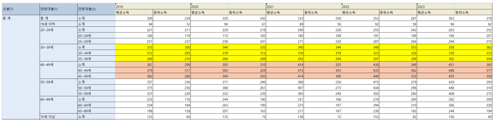

#### 2-1. 30대

- 소득 상승 구간
- 결혼, 출산, 주택, 차량등 대형 소비 이벤트가 집중되어있음

#### 2-2. 40대

- 소득 정점 구간
- 자녀 교육비 본격화
- 가구 소비규모 최대 구간

## 🔑 잠재고객 판단 기준

- **분석 로직**: $$Delta\_Value = \sum Second\_Half - \sum First\_Half$$

- 고객 1명의 2023 3Q ~ 2024 2Q 결제금액 총합 - 2024 3Q ~ 2025 2Q 결제금액 총합
- Delta_Value > 0 인경우 소비량 증가 추세 ⬆ => 잠재고객✅
- Delta_Value < 0 인경우 소비량 감소 추세 ⬇
- Delta_Value = 0 인경우 소비량 일정 -> 소비 성향 고정 -> 제외❌

## 🎯 목적

### 잠재고객 후보 그룹에서 실제 잠재고객은 누구일까❓

 

## 🔍 집단별 분석 결과

### 1. 사회초년생

### 시각화 결과

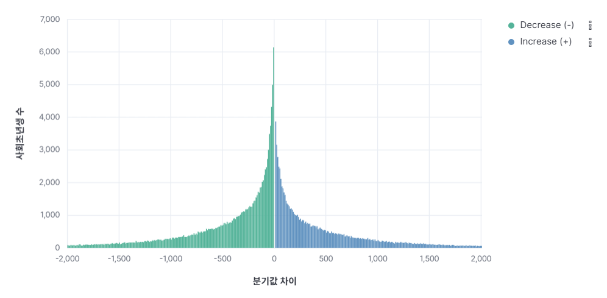

> **Insight**: 히스토그램에서 0점 우측의 'Increase' 유저를 집중 마케팅 타겟으로 선정.

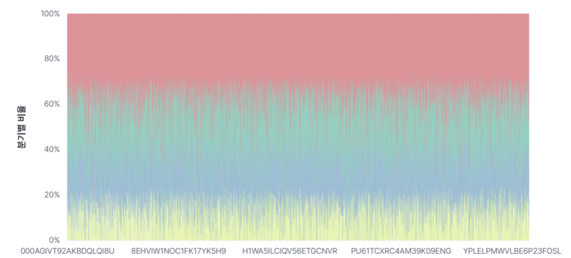

> **Insight**: 특정 시점의 과소비가 아닌, 분기별로 꾸준히 비중이 상승하는 성장형 고객 확인.

---

 

### 2. 신혼부부

결혼 준비 및 신혼 생활 시작 단계에서 발생하는 대규모 지출 패턴을 분석하였다.

### 1. 타겟 고객 식별

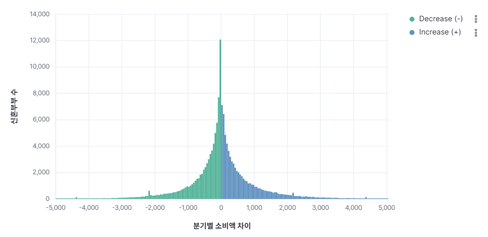

> **Insight**: 신혼부부 그룹 역시 0점 우측의 **'Increase (+)'** 그룹이 핵심 타겟이다. 결혼 전후로 소비 여력이 급격히 상승한 이 유저들을 대상으로 프리미엄 카드 발급 및 고액 할부 혜택 마케팅을 전개할 수 있다.

### 2. 업종별 소비 비중 분석 (Category Insight)

소비가 증가한 유저들이 실제로 어떤 분야에 지출을 집중하고 있는지 42개 세부 업종별로 분석했다.

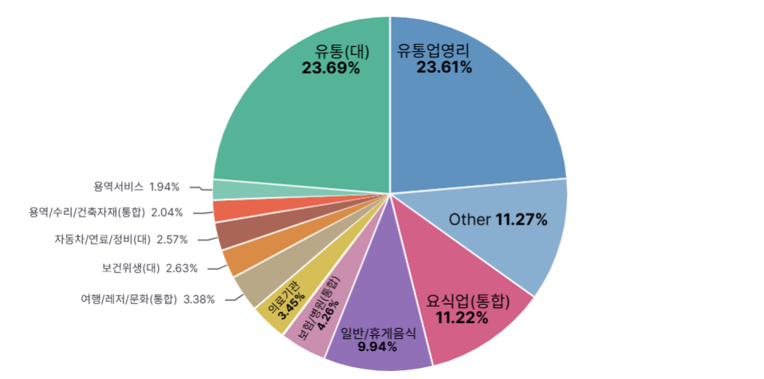

> **Insight (Pie Chart)**:
>
> - **유통/쇼핑 (약 47%)**: 유통(대) 및 유통업영리 비중이 압도적이며 일상적인 쇼핑 혜택에 민감한 그룹임을 확인했다.
> - **요식업 (11.2%)**: 외식 및 배달 소비가 주요 지출 항목 중 하나로 나타났다.
> - **잠정 고객 제안**: 분석된 업종 비중에 맞춰 **대형마트 할인** 및 **배달 앱 캐시백** 서비스가 포함된 카드 상품을 제안할 수 있다.

 

### 3. 의무교육 자녀를 둔 부모

### 1) 타겟 고객 식별

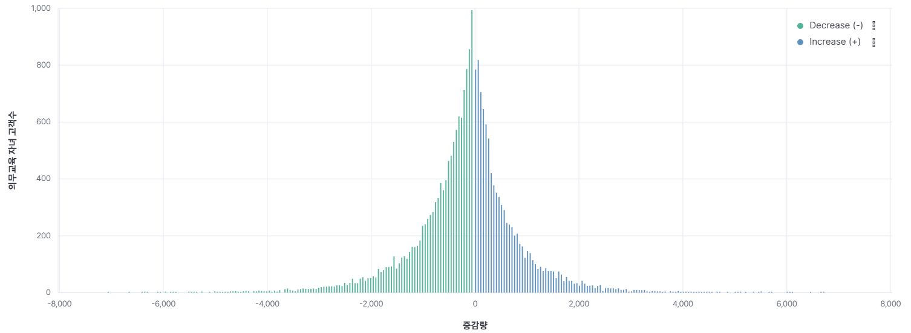
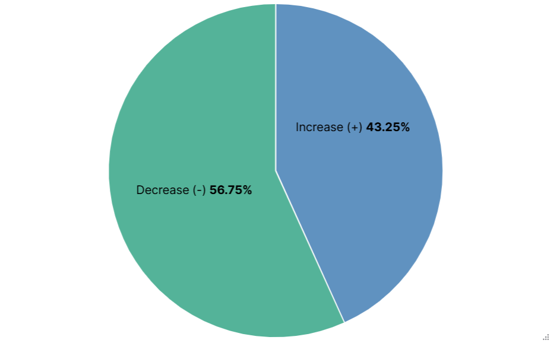

> **Insight**: 증가율보다 감소율이 높다. 물가 상승으로 인한 고정비(교통비, 교육비) 지출 증가가 원인으로 보인다.

### 2) 업종별 증가 소비 분석

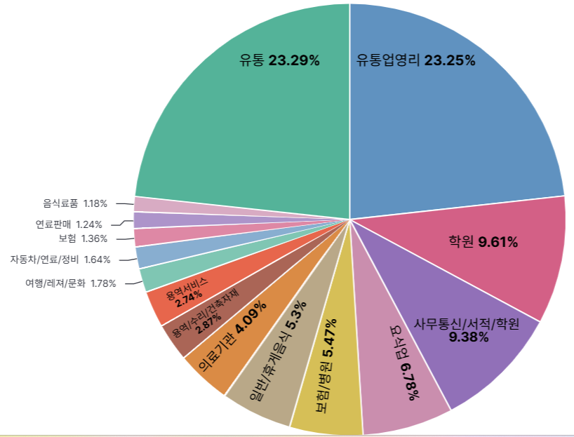

> **Insight**: 유통업, 학원, 사무통신/서적 영역에서 대부분의 소비 증가가 이루어졌다.
> 자녀들과 같이 이루어지는 형태의 고정비가 다수로, 다음과 같은 분야에 할인이 적용되는 것이 잠재 고객의 높은 유치가 가능할 것으로 보인다.

### 4 . 영유아 자녀를 가진 고객

### 1. 타겟 고객 식별

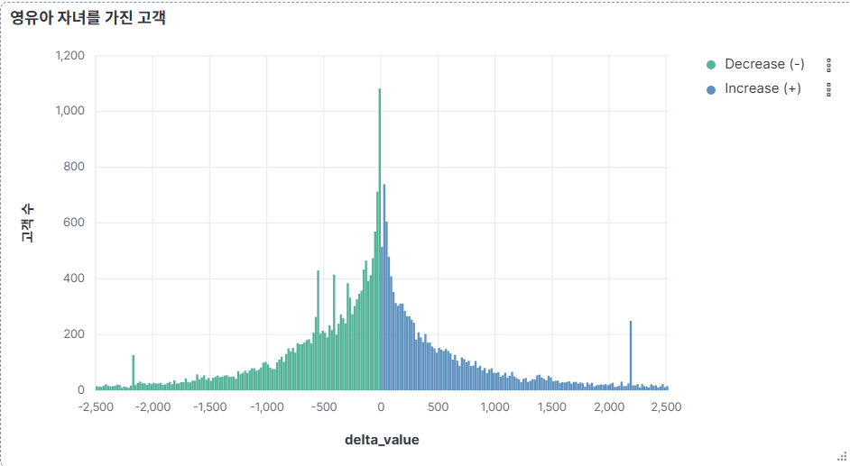

> **Insight**: 자녀 영유아를 가진 고객 또한 0점 우측의 **'Increase (+)'** 그룹이 핵심 타겟이다. 육아 시작 이후 소비가 지속적으로 증가한 고객들이며, 향후 교육·생활비 지출 확대가 예상되는 잠정 고객군으로 판단된다.

### 2. 업종별 소비 비중 분석 (Category Insight)

소비가 증가한 유저들이 실제로 어떤 분야에 지출을 집중하고 있는지 42개 세부 업종별로 분석하였다.

> **Insight (Pie Chart)**:
>
> - **유통업(대)·유통업영리 (약 58%)**: 대형마트 및 생활용품 중심 소비가 가장 큰 비중을 차지하며, 육아로 인한 장보기·생필품 소비 증가가 확인된다.
> - **학원·사무통신/서적/학원(통합) (약 35%)**: 조기 교육 및 자녀 관련 서비스 소비가 이미 시작된 단계임을 시사한다.
> - **보건/병원(통합)**: 정기적인 의료 소비가 발생하는 안정적인 지출 항목으로 확인된다.
> - **잠정 고객 제안**: **대형마트·온라인 쇼핑 할인, 육아·교육 업종 캐시백, 병원·약국 혜택**이 결합된 카드 상품을 제안할 수 있다.

### 5. 30대 고객

소득 안정화 및 라이프 이벤트(결혼·출산·주거 이동)가 집중되는 소비 확장 핵심 연령대를 분석하였다.

### 시각화 결과

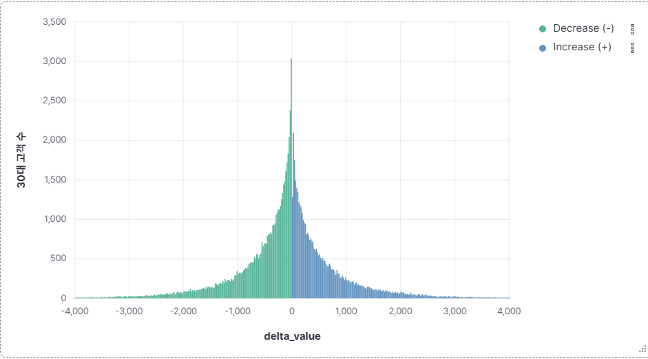

> **Insight**: 30대 고객군에서도 0점 우측의 'Increase (+)' 그룹이 명확히 나타났다. 이전분기 대비 후반기 소비가 증가한 고객이 다수 존재하며, 소비 증가 폭이 큰 고객군이 우측 꼬리(long tail)를 형성하는 것이 특징이다.

### 6. 40대 고객
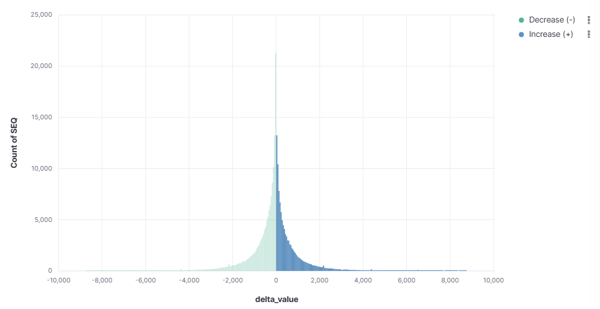

### 7. 대학생 자녀를 둔 부모
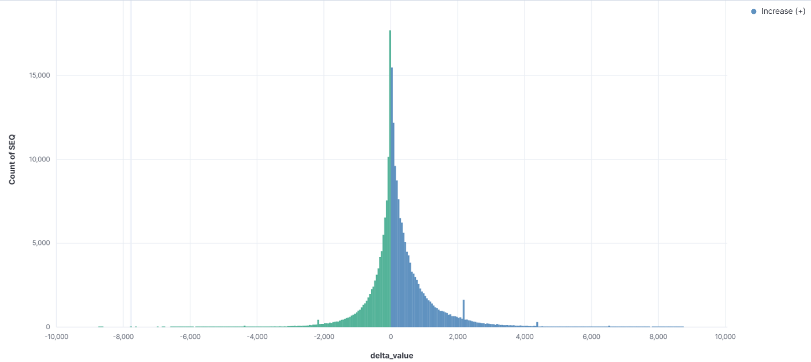
  

### Insight
- Kibana에 시각화 시킬 데이터들은 전처리 시켜놓아야 한다.

### 🔍 향후 추가적인 데이터 정제 관점에서의 개선 사항

- 카드 사용량이 증가하는 추세를 보이더라도, 해당 증가분이 유의미한지 확인 필요. ex) 1회성 결제인지 확인
- 신용카드를 이용하는 고객과 체크카드를 이용하는 고객의 소비습관을 비교하여 이를 반영한 데이터 분석 필요. ex) 체크카드 이용 고객은 안정적인 소비를 추구. 우선순위 = 신용카드 (소득 대비 추가 소비 여부 존재)
- 카드 사용량이 증가 추세를 보이는 고객의 신용카드 대금 연체 내역 조회
- 소비심리 반영 및 물가 상승률 반영

## 🛠 기술 스택 (Tech Stack)

- **Language/DB**: SQL, DuckDB (복합 CTE 및 Delta 로직 구현)
- **Search Engine**: **Elasticsearch** (대용량 금융 데이터 인덱싱)
- **Visualization**: **Kibana** (Lens를 활용한 다차원 시각화 및 대시보드 구축)
- **Collaboration**: Git / GitHub, VS Code

---

## 👥 팀 구성

|  |  |  |  |
| :-------------------------------------------------------: | :------------------------------------------------------: | :--------------------------------------------------------: | :---------------------------------------------------------: |
|         **[강민영](https://github.com/minykang)**         |         **[이유진](https://github.com/janie71)**         |       **[septeratz](https://github.com/septeratz)**        |       **[Sungjun24s](https://github.com/Sungjun24s)**       |

---
